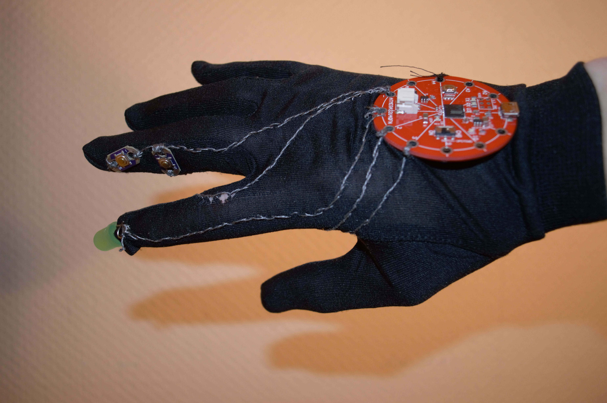

# Hand Tracker
This is a small utility software for moving the mouse cursor with a webcamera and a light source.

## Requirements
* Python 2 (developed and tested with Python 2.7)
* OpenCV for Python (tested with version 2.4.13.5)

## How to run
To run the software, simply run handtrack.py.

## Debug information
When you run the program, a debug image of your webcam will appear showing you the following information:
* The area outlined in blue is the area currently being recognized as the largest bright area, and is thus the one being used to calculate the cursor position.
* The red dot within the blue outline shows the center of the area within that blue outline. The position of this red dot directly corresponds to where the mouse cursor will be positioned.
* The areas outlined in orange are areas that are large enough to be considered possible tracking targets, but that are not being tracked due to there being a larger area present (which is the one outlined in blue)
* The areas outlined in red are areas that are bright enough, but not large enough to be considered for tracking.

To disable this, simply comment out/remove the line saying "self.debug()".

## Optional Arduino setup
Complimentary to the Python code is a small Arduino script to be used for Arduinos supporting the Mouse library. The script was created as part of a hand-crafted glove, using a microcontroller similar to Lilypad along with left and right mouse buttons. 

The script is currently configured for a right mouse button on pin 2 and a left mouse button on pin 3. 
